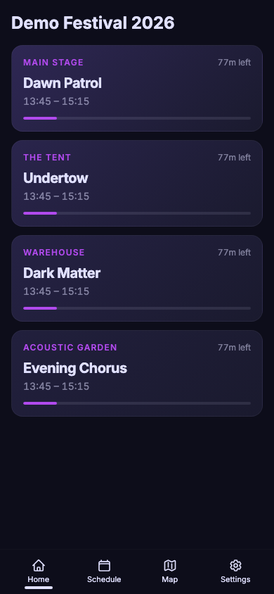
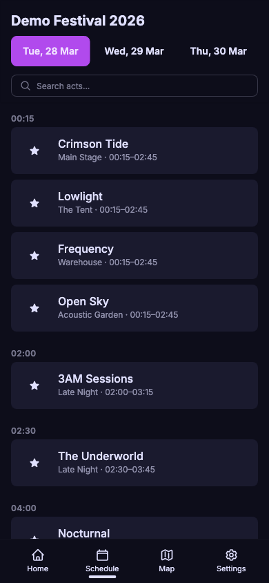
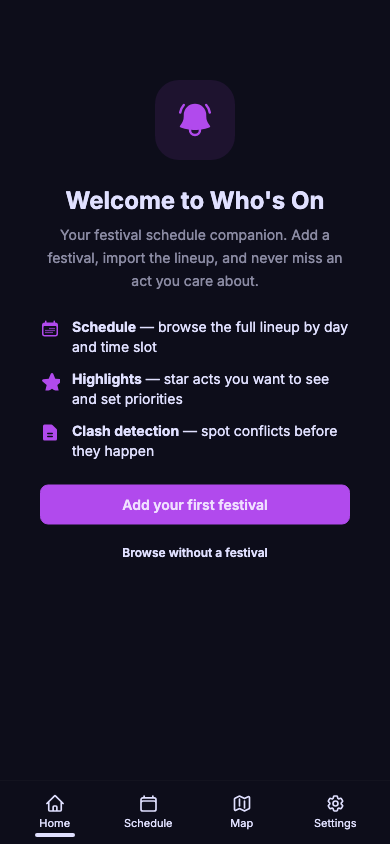

# Who's On

An offline-first festival schedule companion for iOS and Android. Browse artist lineups, highlight your must-sees, detect clashes, and never miss a set.

<p align="center">
  
  &nbsp;&nbsp;
  
  &nbsp;&nbsp;
  
</p>

## Features

- Import schedules from Clashfinder
- Highlight acts and get notified before they start
- Clash detection and resolution
- "Now playing / up next" view
- Local push notifications before sets
- Fully offline — all data stored on-device

## Installation

### iOS — AltStore Classic

WhosOn is distributed via [AltStore Classic](https://altstore.io), a sideloading tool that uses AltServer on your Mac or PC. **AltStore PAL (EU marketplace) is not supported** — it requires Apple notarization.

1. Install [AltServer](https://altstore.io) on your Mac or PC, then install AltStore Classic on your iOS device (iPhone or iPad running iOS 16+).
2. Open AltStore on your iOS device and go to **Browse** → **Sources**.
3. Tap **Add Source** and enter the URL:
   ```
   https://raw.githubusercontent.com/ohjann/whoson/main/altstore/source.json
   ```
4. The WhosOn source will appear — tap **Get** to install.
5. You will need to refresh the app in AltStore every 7 days (or use AltStore+ for automatic refresh).

Alternatively, you can build and install directly from Xcode — see [Building from Source](#building-from-source).

### Android — APK

WhosOn is distributed as a direct APK download (no Play Store required).

1. On your Android device, go to **Settings → Apps → Special app access → Install unknown apps** and enable installation for your browser or file manager.
2. Download the latest `WhosOn.apk` from the [Releases page](https://github.com/ohjann/whoson/releases/latest).
3. Open the downloaded APK to install.
4. If prompted by Play Protect, tap **Install anyway** (the app is open-source and safe to inspect).

## Building from Source

> **Note:** `pnpm dev` runs a local web server for development and debugging. The web browser is not a release target — the app ships as native iOS and Android builds via Capacitor.

### Prerequisites

| Tool | Minimum Version |
|------|----------------|
| Node.js | 20 |
| pnpm | 10 |
| Xcode | 16 (iOS builds) |
| Android Studio | Latest stable (Android builds) |
| CocoaPods | 1.15+ (iOS builds) |

### iOS

```bash
# Clone the repository
git clone https://github.com/ohjann/whoson.git
cd whoson

# Install dependencies
pnpm install

# Build the web app
pnpm build

# Add the iOS platform (first time only)
pnpm cap add ios

# Generate icons and splash screens
pnpm generate:assets

# Sync web assets to native
pnpm cap sync ios

# Open in Xcode
pnpm cap open ios
```

In Xcode, select your development team under **Signing & Capabilities**, then build and run on your device or simulator.

### Android

```bash
# Install dependencies
pnpm install

# Build the web app
pnpm build

# Add the Android platform (first time only)
pnpm cap add android

# Generate icons and splash screens
pnpm generate:assets

# Sync web assets to native
pnpm cap sync android

# Open in Android Studio
pnpm cap open android
```

In Android Studio, wait for Gradle sync to complete, then build and run.

### Generating App Icons and Splash Screens

Source assets live in `resources/`:
- `resources/icon.png` — 1024×1024 icon
- `resources/splash.png` — 2732×2732 splash screen

After adding native platforms, regenerate platform-specific assets:

```bash
pnpm generate:assets
# or directly:
pnpm @capacitor/assets generate
```

This populates `ios/App/App/Assets.xcassets` and `android/app/src/main/res/` with all required sizes.

## Development

### Project Structure

```
src/
  lib/
    db/          # Dexie.js database schema and migrations
    features/    # Feature-based modules (schedule, highlights, etc.)
    components/  # Shared UI components
    types/       # TypeScript types
    utils.ts     # Shared utilities (cn(), etc.)
  routes/        # SvelteKit pages and layouts
resources/       # Source icon and splash screen assets
altstore/        # AltStore distribution metadata
scripts/         # Build helper scripts
```

### Tech Stack

- [SvelteKit](https://kit.svelte.dev) 2.x with Svelte 5 runes
- [Tailwind CSS](https://tailwindcss.com) 4 + [daisyUI](https://daisyui.com) 5
- [Dexie.js](https://dexie.org) for IndexedDB (all offline data)
- [Capacitor](https://capacitorjs.com) 7 for native iOS and Android

### Running Tests

```bash
# Run all tests once
pnpm test:run

# Run tests in watch mode
pnpm test

# Type check
pnpm check
```

Tests live alongside source files as `*.test.ts`.

### Live Reload on Device

```bash
# Requires iOS device on same LAN
pnpm dev:cap
```

This detects your local IP, updates the Capacitor config, syncs to native, and opens Xcode.

## Contributing

Contributions are welcome. Please open an issue to discuss significant changes before submitting a PR.

1. Fork the repository
2. Create a feature branch: `git checkout -b feat/my-feature`
3. Make your changes following the patterns in `CLAUDE.md`
4. Run `pnpm check` and `pnpm test:run` — both must pass
5. Open a pull request with a clear description

### Code Conventions

See `CLAUDE.md` for full project conventions. Key points:

- Svelte 5 runes only (`$state`, `$derived`, `$effect`, `$props`) — no Svelte 4 patterns
- All data in Dexie.js — no server-side storage
- TypeScript strict mode throughout
- Feature-based directory structure under `src/lib/features/`

## License

MIT — see [LICENSE](LICENSE).
